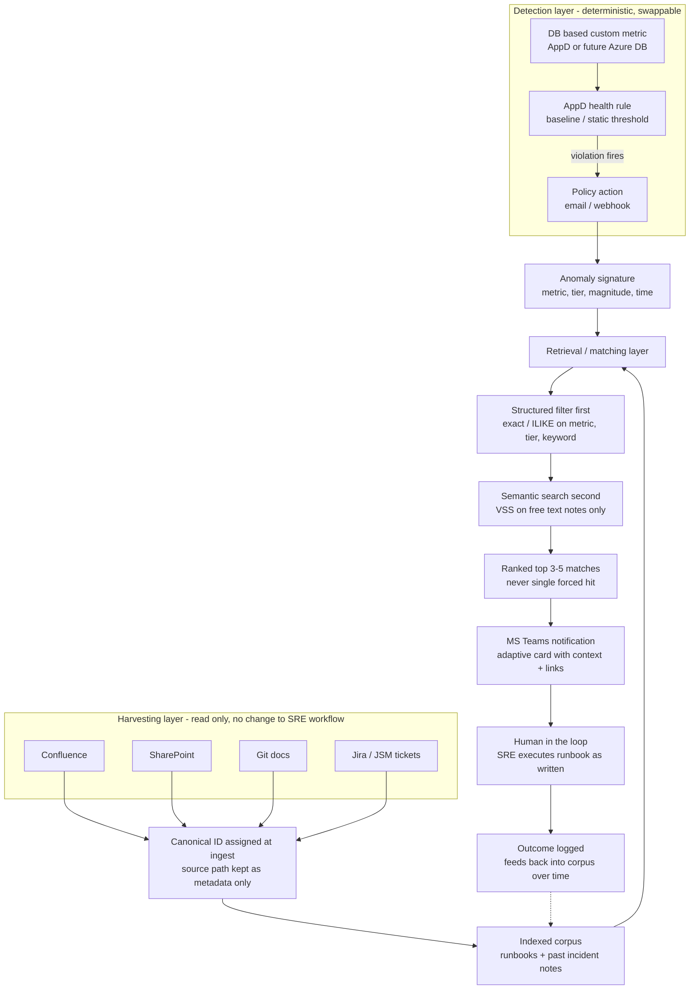

NEW CUSTOM METRIC IN APPD... DOES IT MAKE SENSE TO PULL THAT DATA OUT INTO SOMETHING LIKE A PROM+GRAFANA.... PROM CAN SCRAPE THE REST API ENDPOINT FOR NEW CUSTOM METRIC IN APPD AND NEXT STEPS - FEATURES/CAPABILITIES CAN BE BUILT IN PROMGRAF ETC? OR DOES IT MAKE SENSE STAYING IN APPD

GOAL IS TO BUILD A PROACTIVE BUSINESS MONITORING KPI LAYER IN APPD AND THEN ADD THE ANOMALY DETECTION AND REMEDIATION AS NEXT STEPS, FOR WHICH THERE NEEDS TO BE SOME CAPTURED HISTORICAL KNOWLEDGE, LIKE A RAG BASED KB OR SOMETHING LIKE THAT?
Weighed architectural trade-offs for monitoring infrastructure integration

TLDR: Given your end-goal (anomaly detection + RAG-based remediation KB), Prom+Grafana is the better foundation than staying AppD-only — AppD can't natively feed a RAG pipeline or run custom anomaly models, but a Prometheus-backed store can.

Why "stay in AppD" hits a wall for your actual goal:

    AppD's anomaly detection (baseline/Health Rules) is a closed black box — you can't extract its internals, train custom models on top of it, or feed its historical reasoning into a RAG knowledge base
    AppD has no concept of "remediation knowledge" — Health Rules trigger policies/notifications, not a queryable history that an LLM/RAG layer could reason over
    Anything beyond "alert fires, human looks at dashboard" requires getting the data out of AppD into something programmable

Why Prom+Grafana is the right next layer, not just a nicer dashboard:

    Prometheus's TSDB + PromQL gives you queryable historical data — predict_linear(), deriv(), and recording rules are workable as basic anomaly logic, and downstream tools (Grafana's anomaly detection plugin, or custom job querying Prom) can layer on top
    Once data lives in Prometheus, you can fork a parallel pipeline: same metric data → a structured store (e.g., Postgres/Log Analytics) → embeddings → vector DB → RAG. AppD's closed data model can't participate in that at all
    Grafana becomes the human-facing layer (KPI dashboards) while Prometheus's stored history becomes the machine-facing layer your anomaly detection and RAG-remediation systems actually query against

Important scoping correction from earlier in this thread: Prometheus is scrape-based, not "Prom scrapes AppD's REST API directly" — AppD doesn't expose a Prometheus-format /metrics endpoint. You still need a small poller/exporter in between:

AppD Custom Metric (REST, pull-only)
  → small poller (Container Apps Job / cron / whatever-non-Functions you land on)
      - fetches AppD metric-data
      - re-exposes it as a /metrics endpoint in Prometheus exposition format
  → Prometheus scrapes that endpoint
  → Grafana (dashboards)
  → [Postgres/Log Analytics + embeddings] (RAG KB, future)
  → [anomaly model / Metrics Advisor-replacement] (future)

This "exporter pattern" (poll source → expose as /metrics → Prometheus scrapes the exporter, not the source) is the standard way to bridge any pull-only API into Prometheus — common pattern, not a hack.

Practical staged plan matching your stated goal:

    Now: build the exporter + Prometheus + Grafana KPI layer for your one Custom Metric — this is your "proactive business monitoring KPI layer"
    Next: once 2-3 months of history exists in Prometheus, start the anomaly detection layer (PromQL-based rules first, ML model later if needed)
    Later: stand up the RAG KB — incident/violation history + remediation notes, embedded and queryable, fed by the same metric store

One honest tradeoff to flag: this is more moving parts than AppD-only (exporter + Prometheus + Grafana vs. AppD's all-in-one), but it's the only path that gets you programmable historical data — which is a hard requirement for both anomaly detection customization and RAG, neither of which AppD's platform exposes a way to build on top of.

Want the exporter skeleton (poll AppD → expose Prometheus format) as the concrete next step?

APPD HAS ANOLMAY DETECTION AND VIOLATION REPORTS/ALERTS/NOTIFS ETC

Fair pushback — let me correct the framing rather than just restate my prior point.

You're right that AppD already has this, natively, today:

    Anomaly detection: baseline-based Health Rules (dynamic thresholds, std-deviation comparison)
    Violation reports: built-in, historical, queryable in the Controller UI
    Alerts/notifications: Policies + Actions (email, webhook, ticketing integrations) — already working infra, no new pipeline needed

So the honest question is: what does AppD's native anomaly detection actually lack for your goal? Two real gaps, not "AppD can't do anomaly detection":

    No RAG/remediation knowledge layer — AppD tells you that something violated and what the baseline deviation was. It has no mechanism to say "here's what we did last time this happened" or surface contextual remediation guidance. That's not an anomaly-detection gap, it's a knowledge-management gap layered on top of alerts AppD already generates.
    Violation history isn't easily exportable/queryable outside the UI — if you want an LLM/RAG system to reason over past violations + their resolutions, you need that history as structured, exportable data (via API), not locked in Controller's UI/reports.

Revised recommendation, less infra than what I said before:

    Keep AppD's anomaly detection and Health Rules as-is — don't rebuild what already works
    Pull violation/alert history via AppD's REST API (Health Rule Violations endpoint exists for this) into a structured store
    Build the RAG layer on top of that violation history — embed violation details + whatever remediation notes/runbooks you pair with them, queryable by an LLM later
    Skip Prometheus/Grafana entirely for this specific goal — that stack only earns its place if you need custom PromQL-based anomaly logic AppD doesn't offer, which doesn't sound like your actual gap

This is a much smaller lift: poller pulls violation history (not continuous metric streaming) → structured store → embeddings → RAG. Want me to find the exact AppD REST endpoint for Health Rule Violation history so we can scope that pull?

BIG PICTURE THINKING REQUIRED... SHOW ME A LHS-RHS OF THE 2 APPROACHES OR ANY MORE/OTHER RN
Architected side-by-side comparison of monitoring solution approaches

Quick read on the three paths, since the diagram only carries the structure:

A) Stay in AppD — zero new infra, but you hit the wall you already identified: no way to build a RAG-based remediation layer on top of a closed system. Good enough if leadership's bar is "alerts work," not "we learn from history."

B) Export everything to Prometheus — full programmability (PromQL, custom anomaly models, arbitrary downstream consumers), but it's the heaviest lift: poller/exporter + Prometheus + Grafana, all to replace something AppD already does reasonably well (baseline detection, alerting).

C) Hybrid — this is what I'd actually argue for given your stated goal. Leave AppD's Health Rules, baselines, and alerting exactly as they are (they work, no reason to rebuild them). Separately, pull just the violation/alert history (not continuous metric streaming) into a structured store, and build the RAG/remediation KB on that. This targets the actual gap (no institutional memory) without re-platforming working anomaly detection.

The deciding question for leadership: is the goal "replace AppD's detection" or "add a memory layer AppD doesn't have"? If it's the latter — which is what you described — C gets you there with the least new surface area to maintain.

MAKE A NOTE.. I AM COLOR BLIND,, SO NEVER USE COLORS IN MERMAIDJS DIAGS
Added memory

Noted — no colors in Mermaid.js diagrams going forward.

I AM APDD-IGNORANT. IS THE EXTENT OF "REMEDIATION" IN APPD BEGIN/END WITH "ALERTS" ? VISUAL OR EMAIL OR SLACK
Searched the web

No — AppD's "remediation" actually goes beyond just notifications. There are three action categories, not one:

1. Notification actions — what you assumed: Email, Slack, PagerDuty/ServiceNow-style integrations, custom webhooks
2. Diagnostic actions — auto-triggered thread dumps, transaction snapshots triggered by violations of business transaction performance health rules or by slow or stalled transaction events — gives you forensic data, not a fix
3. Remediation actions (the real automation tier) — a remediation action runs a local script in a node, executing on the affected machine or a designated node. This is genuine automated runbook execution: a remediation action named "increasePool" executes a local script that increases the size of the connection pool on a JVM, triggered by a Resource Pool Limit event — so AppD can literally run a shell/perl/etc script to fix the problem, not just alert on it.
Grafana + 2

Important caveats specific to your situation:

    Remediation scripts require a Machine Agent installed on the host where the script runs, and the Machine Agent must connect via SSL to be allowed to run scripts at all — this is a hard requirement, not optional
    Grafana
    Grafana
    You can require email approval before a script runs — human-in-the-loop gating is built in, useful if leadership is nervous about auto-remediation
    Grafana
    There's a rate limit — by default 5 actions per minute per machine per action type, to prevent runaway automation
    Grafana
    Custom Metrics are DB-query-based, not node-agent metrics — remediation scripts trigger off Health Rule violations on nodes/tiers/BTs. Whether a Custom Metric-based Health Rule can trigger a remediation script depends on whether that Custom Metric is scoped to an entity with a Machine Agent attached — worth verifying with your AppD admin, since your "dumb counts" are DB-sourced, not host/JVM-sourced

Bottom line for your RAG/remediation goal: AppD already has a "run a script to fix it" mechanism — the gap isn't capability, it's that the script logic is static/manual (you write the fix once, it always runs the same way) versus what you're envisioning (an LLM/RAG layer reasoning about which remediation fits this specific anomaly based on history). That's a meaningfully different, more sophisticated thing than what AppD's remediation scripts do — they're runbook automation, not adaptive/contextual remediation.

AND WHAT DO U THINK LLM+RAG DO? BEYOND FT SEARCH/SEMANTIC SEARCH ETC... WHAT PROBLEMS DOES LLM+RAG SOLVE ON THE "REMEDIATION" REQ?
Marshaled substantive analysis of LLM+RAG remediation advantages

Fair challenge — let me be precise about what RAG+LLM actually buys you here, beyond "better search," because that distinction matters for justifying the architecture to leadership.

What retrieval alone (no LLM) gives you: find similar past incidents by keyword/semantic similarity. Useful, but the human still has to read 5 past incidents, cross-reference what was different about each, and decide what applies now. That's just a faster filing cabinet.

What LLM+RAG adds on top — the actual remediation-specific value:

1. Context synthesis across heterogeneous sources, not just similarity matching
A static AppD remediation script can only react to one signal (the Health Rule that fired). An LLM+RAG layer can pull in the violation, the DB query result shape, related tier/BT errors at the same timestamp, last quarter's postmortem notes, and a runbook doc — then reason about which combination of factors actually matches this situation, rather than pattern-matching on a single metric threshold.

2. Non-identical-match reasoning
Vanilla semantic search finds "this looks like that." An LLM can reason about partial matches — "this is similar to incident #47, but the DB connection pool was different, so the fix that worked there probably needs adjusting." Retrieval surfaces the candidates; the LLM does the judgment call a script can't.

3. Natural-language remediation guidance vs. fixed scripts
AppD's remediation script is deterministic — same trigger, same script, every time. It can't say "this is the third occurrence this week, escalate instead of auto-remediating" or "the underlying cause shifted, here's what changed since last time." An LLM can generate situational guidance, not just execute a fixed action.

4. Closing the loop — learning from what actually happened
This is the genuinely novel piece AppD has zero concept of: after a remediation runs (script or human action), you can record the outcome back into the knowledge base. Next time, retrieval surfaces "this fix worked" or "this fix was tried and failed, here's why." AppD's remediation scripts have no memory of their own success/failure rate per situation — they just re-run identically forever.

5. Bridging business KPI context to technical remediation
Since your goal is specifically business KPI monitoring (not pure APM), this matters: an LLM can connect "order volume dropped 20%" to "this correlates with a deploy 10 minutes earlier + a related error spike in tier X" — synthesizing across business and technical signals that live in separate AppD views today, with no native correlation between them.

The honest limit, to keep yourself calibrated: none of this replaces the actual remediation execution — Step 5 in AppD's pipeline (run the script) still has to happen via AppD's own mechanism or your own automation. RAG+LLM's value is entirely in the decision layer above the execution layer — better triage, better context, accumulated institutional memory. If leadership's bar is "make incidents self-heal automatically," that's still scripts/runbooks (AppD already does this). If the bar is "make our humans and our automation smarter about which fix to apply, using everything we've learned," that's where LLM+RAG earns its place, and AppD has nothing like it.

WHY WONT APPD ANOMALY DETECTION WORK? I HAVE BUILT A "REACTIVE" BASED SYSTEM BASED ON A JIRA CHAT BOT SOLUTION... THE SQL (PGVECTOR) VSS VS. SQL ILIKE WAS A NIGHTMARE WITH A "LLM GUIDED DECISIONING LAYER". SUPER NON-DETERMINISTIC, AND I LANDED ON LEANING TOWARDS ILIKE AND USING VSS FOR OUTLIERS..... THIS, WHAT I INTEND TO DO IS "PROACTIVE" AND "REALTIME" IE AHEAD OF TIME AS OPPOSED TO JIRA/TICKETING SYSTEM BASED "REACTIVE", AFTER-THE-FACT KIND OF ARCHITECTURE AND DESIGN
Reconciled AppD's native proactive detection with LLM-triggered nondeterminism concerns

Good distinction to draw out, and it actually changes my answer: AppD's anomaly detection already is proactive and real-time — it doesn't have the problem your Jira bot solved.

Where the confusion might be: your Jira RAG system was reactive because the trigger was a human filing a ticket after something already broke — retrieval/LLM reasoning happened post-hoc, after the fact. AppD's baseline-based Health Rules are the opposite: they evaluate the metric stream continuously and fire before a human notices, the moment the value crosses a statistical threshold. That's already "ahead of time," not after-the-fact. So if your concern is "will AppD even detect things proactively" — yes, that part isn't the gap.

The actual nondeterminism lesson from your Jira bot is more important than it looks — apply it here, don't repeat the mistake:

Your ILIKE-vs-VSS struggle happened because you put an LLM in the decision path (deciding whether something even matched/mattered). That's exactly the failure mode to avoid in a proactive system: never let an LLM be the trigger. The trigger has to stay deterministic — a statistical threshold, a baseline deviation, a fixed rule — precisely because LLM-driven decisioning is non-deterministic and you already proved that to yourself.

So the correct architecture split is:
Layer	What decides	Determinism needed
Detection/trigger	AppD baseline Health Rule (or Prom series_decompose_anomalies if you go that route)	Must be deterministic — this is your "is something wrong, right now" gate
Remediation guidance	LLM+RAG, invoked after the deterministic trigger fires	Non-determinism is acceptable/expected here — it's advisory, not the gate

This mirrors what you landed on for the Jira bot (ILIKE for matching, VSS for outliers) — same principle: deterministic logic decides "did something happen," probabilistic/LLM logic decides "what does it mean and what should we do about it." Don't let the second job creep into the first.

Net answer to your literal question: AppD's anomaly detection won't "not work" for a proactive/real-time use case — it's already built for exactly that. What it lacks is everything downstream of the trigger: institutional memory, contextual remediation reasoning, cross-signal synthesis. That's the part LLM+RAG adds, and it should sit strictly after AppD's (or Prometheus's) deterministic trigger fires — not replace it.

LONG STORY SHORT, REMEDIATION IS WHAT I STILL NEED TO SOLVE/THINKTHROUGH? Y/N

Y.

Detection (proactive, real-time) — solved, AppD already does it. Remediation reasoning (what to do, informed by history) — open problem, that's the actual work ahead of you.

NOW IF MANAGEMENT IS AZURE APPINSIGHTS FRIENDLY/AWARE, WD APPINSIGHTS HELP FOR REMEDIATION AT ALL ... THE GOAL IS MOVING ON PREM SYSTEMS TO THE CLOUD AND THATS WHERE THE DB BASED CUSTOM METRICS WILL MOVE TO IE THE DBS... SO THE NATURAL QUES FROM LEADERSHIP WD BE DO WE NEED PROM+GRAF OR JUST DO EVERYTHING MAGICALLY IN APPINSIGHTS OR W/E AZURE HAS LIKE AZ MONITOR ETC

TLDR: No — App Insights/Azure Monitor doesn't solve remediation either; it's the same gap as AppD, just on Azure. "Do it magically in App Insights" isn't an option that exists — neither platform has a remediation reasoning layer, only deterministic detection + action execution.

Direct answer to the leadership framing: Azure Monitor/App Insights gives you the Azure-native equivalent of AppD's detection layer, not something beyond it. Specifically:
Capability	AppD	Azure Monitor / App Insights
Deterministic detection	Health Rules (baseline/static)	Metric Alerts (static or dynamic threshold)
Action execution	Remediation scripts on Machine Agent	Action Groups → Azure Automation Runbooks / Logic Apps / Functions
Institutional memory / contextual reasoning	None	None
RAG/LLM-based remediation guidance	None	None

Azure's version of "run a script to fix it" is Action Groups triggering an Azure Automation Runbook or Logic App — functionally the same idea as AppD's remediation scripts (deterministic, same-fix-every-time), just hosted differently. Still no judgment layer.

Why "everything magically in App Insights" doesn't hold up as a leadership answer: App Insights is a telemetry platform, not a reasoning platform. It can detect and notify/act, exactly like AppD does — moving to Azure changes where the data lives and which vendor you pay, but doesn't introduce anything that closes your actual gap (contextual, history-informed remediation guidance).

What this means for the Prom+Grafana question specifically: if the migration goal is "lift-and-shift detection/alerting from AppD to Azure-native," App Insights/Azure Monitor alone is sufficient — you don't need Prometheus for that, since Azure Monitor's KQL-based metric alerts cover the same deterministic-trigger role AppD's Health Rules play now. Prometheus/Grafana only becomes relevant if you specifically want PromQL-style querying or plan to build custom statistical models outside Azure Monitor's built-in alerting — not for the remediation gap, which neither stack touches.

The honest one-line answer for leadership: "Whichever Azure monitoring tool we pick (App Insights, Azure Monitor, or Prom+Grafana) solves detection — the remediation/institutional-memory layer is a separate build either way, RAG-based, sitting on top of whichever detection platform we choose." This decouples the "which monitoring tool" debate from the "how do we get smarter remediation" debate — they're not the same decision, and conflating them is probably where the leadership conversation could get muddled.

I AM TRYING TO STAY ON APPD, BUT ONCE THE LICENSE IS UP FOR RENEWAL, IF THE COMMERCIALS DONT ADD UP, WE "MAY" NEED TO MOVE THE APPD CUSTOM METRICS FROM APPD INTO APPINSIGHTS OR W/E AZURE "OFFERS"... "MAGICALLY" WAS A THINLY VEILED DIG AT EXECUTIVES NAIVE THINKING BTW....

Ha — fair, the "magically" framing makes a lot more sense now, and honestly it's a useful thing to anticipate rather than dismiss, since you'll likely have to answer it in the room.

Reframe for that conversation: the honest answer isn't "Azure can't do it" — it's "Azure can do it, at the same effort level AppD took to set up, because no monitoring vendor has actually solved this." That's a stronger argument against naive "just use Azure" thinking than "Azure lacks features," because it preempts the follow-up "well what about [some Azure AI feature they half-remember from a keynote]."

Practical positioning, given this is contingency planning (license renewal, not active migration):

    Detection/alerting is a clean swap if you ever need it — your DB-based Custom Metrics, wherever the DB lands (on-prem or Azure), can feed Azure Monitor Metric Alerts the same way they feed AppD Health Rules today. This part genuinely is close to "lift and shift" — same query, same trigger logic, different platform. Worth having this as your "yes, we have an exit ramp" answer if licensing becomes the issue.
    Remediation/RAG work should be built decoupled from the detection platform now — if you design the RAG/remediation layer to consume violation events generically (timestamp, metric, value, context) rather than tightly coupling to AppD's specific webhook/export format, you don't redo that work if/when the detection layer changes. This is the practical hedge: build the part that doesn't yet exist (remediation) in a vendor-agnostic way, since you don't yet know which platform it'll sit on top of long-term.
    For the leadership deck, the message that holds up under scrutiny: "Our biggest gap — institutional memory and contextual remediation — exists regardless of which monitoring vendor we use. Switching to Azure doesn't solve it for free, and staying on AppD doesn't block us from building it. So vendor choice and remediation strategy are two separate decisions, and we should build remediation now without waiting on the licensing outcome."

That last point is probably your strongest card if someone in the room treats "move to Azure" as a one-line fix for problems AppD also doesn't solve.

THEY WANT THE REMEDIATION SYSTEM. APPD CURRENTLY WORKS FOR BUSINESS METRICS. THERE ARE LICENSE HEADROOM LIMITS. THE LICENSE IS NOT FREE AND THE COST MIGHT GO UP/DOWN WHEN ITS DUE FOR NEXT RENEWAL. WE MIGHT NEED TO HAVE AN OFF-RAMP PROPOSITION IF/WHEN ASKED.

THAT SAID I DONT SEE HOW LLM+RAG SOLVES ANYTHING ON THE "REMEDIATION" PART. AS I SAID BEFORE I FOUND VSS/DISTANCE SEARCH TO BE EXTREMELY INACCURATE AND HAD TO BUILD A SEQUENTIAL LOGICAL PIPELINE OF ILIKE FIRST AND THEN VSS, FOR DATA "UNDERSTANDING" AKA PATTERNS.... IF APPD /AZINSIGHTS ALREADY DOES METRICS, ANOMALY DETECTION (BASED ON PATTERNS OBV AND HISTORICAL TRENDS ETC). WHAT WD LLM+RAG DO? ALSO DEPENDS ON WHAT "REMEDIATION" MEANS E.G. CREATE A TICKET, GENERATE A SCRIPT, SEND A SLACK MESSAGE TO NOTIFY OPS WITH RUNBOOK ETC ETC REMEDIATION COULD LITERALLY MEAN ANYTHING !! 

TO BE MORE SPECIFIC, WHAT DID U HAVE IN MIND WHEN U SPOKE OF THE EXTERNALIZED/DECOUPLED REMEDIATION SYSTEM? IT WILL GENERATE SCRIPTS ON THE FLY OR LOOK UP WHAT SCRIPTS WORKED FOR THE SAME/SIMILAR PROBLEM IN THE PAST...
Reconciled skepticism with concrete remediation scope definition

TLDR: Concretely: lookup of past fixes, not on-the-fly generation — scoped to "find what worked last time," using your proven ILIKE-first pipeline, not pure VSS.

You're right to push on this — "remediation" was doing a lot of unearned work in my answers. Let me commit to a specific definition rather than leaving it open-ended.

What I'd rule out immediately: LLM generating a fix script on the fly from scratch. That's the most dangerous and least reliable version of this — an LLM hallucinating shell commands to run against production based on a metric anomaly is a liability, not a feature. Don't build that.

What I actually have in mind, concretely: a lookup system, not a generation system. When a Health Rule fires for "order count dropped to 0 for 10 minutes," the system retrieves: was this exact metric/tier combination violated before, what was logged as the cause, what action was taken (a person ran X script, restarted Y service, it was a false positive from a deploy), and did it work. That gets surfaced to whoever's on call — as a suggestion with citation to the past incident, not an auto-executed action. The "remediation" is literally: surface the closest matching past resolution, with its outcome, fast enough to matter — that's it. No script generation, no autonomous action.

Given your ILIKE-vs-VSS lesson, here's how I'd actually structure retrieval, not generation:

    Structured fields first (ILIKE/exact match): metric name, tier, application, time-of-day bucket, magnitude of deviation. These are categorical/numeric — exact or range match is more reliable than embedding similarity for this kind of data, exactly like your Jira bot found
    VSS only on the free-text portion: whatever human-written notes exist on past incidents ("turned out to be a batch job overlapping with peak hours") — this is where semantic search earns its keep, because that's actual prose, not structured metadata
    No LLM in the trigger or matching path at all — just retrieval, ranked, shown to a human. The LLM's only job (if any) is summarizing the retrieved incident into a one-line note, which is low-stakes and easy to verify against the source

So to directly answer your either/or: it's lookup, not generation. "Generate a script on the fly" is the version I'd actively argue against building. "Look up what worked for the same/similar problem before" is the version that's actually buildable, low-risk, and matches the architecture pattern you already validated works (ILIKE-first, VSS-second, no LLM as the gate).

One honest caveat: if this is the scope, you may not need an LLM at all for the core function — a well-indexed Postgres table with structured filters plus a single VSS pass over notes might get you 90% of the value without the nondeterminism overhead you already fought through once. The LLM's role shrinks to "nice-to-have summary," not "core remediation engine." Worth deciding if that's still worth calling an "LLM+RAG system" to leadership, or just "a structured incident knowledge base with semantic search on the notes field" — the latter is a much easier sell and a more honest description of what you'd actually be building.

WHAT IF THERE IS NO HISTORICAL RECORD OF A SCRIPT BEING USED.. OUR SRE/DEVOPS TEAMS USE RUNBOOKS.... THEY FOLLOW IT FAITHFULLY TO THE T. THEY WILL GET FIRED IF THEY DONT
Reframed solution as runbook retrieval system instead of remediation

That changes the scope significantly, and in a good way — it makes the system much safer and easier to defend to leadership.

Cold-start case (no incident history yet): the system falls back to retrieving from the existing runbook library, not generating anything. Same retrieval pattern (structured filters first — metric, tier, error type — then semantic search over runbook text for the rest), but the corpus is your SRE team's existing, approved runbooks instead of past-incident notes. The system's job becomes: find the right runbook fast, not invent a fix.

This actually simplifies the whole pitch, given how your SREs operate:

    If they follow runbooks to the letter regardless, the system never needs to author or suggest a fix — only point to the correct existing procedure, ranked by relevance to the current anomaly
    No hallucination risk on the "what to do" part, since "what to do" is always sourced verbatim from an approved document a human already wrote and the team already trusts
    The only genuinely new value-add is speed of retrieval at 2am — instead of someone manually searching a runbook wiki/Confluence for "which doc covers this," the system surfaces the matching one immediately, with the anomaly's specifics already pulled in for context

Once incident history accumulates over time, it becomes a second, complementary source layered on top — "here's the runbook that applies, and here's that this exact combination happened 3 times before, each time runbook X was followed and it resolved within 12 minutes" — but that's a refinement, not a requirement to get started.

Revised, much more concrete pitch for leadership: "A retrieval system over our existing runbook library and growing incident history, surfacing the correct, pre-approved procedure the moment an anomaly fires — not an AI deciding what to do, an AI finding what we already know to do, faster." That's a far easier sell than anything framed as "AI-driven remediation," and it sidesteps every objection about autonomous action or hallucinated fixes, since the SRE still executes the runbook exactly as written, just gets routed to it faster.

Does the runbook library currently exist in a structured/searchable form (Confluence, Git-based docs-as-code, etc.), or is that itself part of what needs building first?

I NEED TO FIGURE OUT IF THERE IS A COMMON PLACE WHERE ALL THE RUNBOOKS ARE STORED... I WD GUESS THAT THEY ARE ALL OVER THE PLACE IN DIFFERENT SYSTEMS..... SO IG THE FIRST STEP IS TO IDENTIFY WHERE THOSE RUNBOOKS ARE AND STREAMLINE THEM? WHAT IS THE EXECUTIVE-FRIENDLY WAY TO FRAME THIS FROM A POSITIONING PERSPECTIVE? ALSO AFAICS WE ARE LANDING RN ON REMEDIATION==PLAYBOOK IDENTIFICATION AND NOTIFY TO A H IN A HITL IN A SYSTEM LIKE MS TEAMS? WE DONT USE SLACK ETC

TLDR: Yes — discovery/inventory of scattered runbooks is the real Phase 0, and "remediation = playbook identification + human-in-the-loop notify via Teams" is an accurate, sellable scope.

Executive framing for the runbook discovery phase — position it as a knowledge audit, not a tooling project:

    "Before we can make incident response faster, we need a single source of truth for 'what do we do when X happens.' Today that knowledge is fragmented across Confluence, SharePoint, individual team wikis, and tribal memory. Phase 1 is a discovery audit: locate every runbook, assess coverage gaps, and consolidate into one indexable location. This is foundational — it has standalone value (faster onboarding, audit-readiness, reduced bus-factor risk) even before any AI/automation layer touches it."

This framing does three things that help in the room: it's a small, low-risk, cheap-to-approve first step; it has value independent of whether the AI layer ever gets built (so it's not a sunk-cost gamble); and it surfaces the real blocker (fragmentation) before anyone overcommits to an architecture.

Confirmed scope — your landing point is accurate and defensible:

Anomaly fires (AppD/Azure Monitor)
  → Retrieval: match anomaly → correct runbook (structured filter + semantic search)
  → Notify: post to MS Teams channel/card with runbook link + anomaly context
  → Human: executes runbook exactly as written (HITL, no auto-action)

This is not "AI remediation" in any sense that should worry leadership — it's a notification routing/lookup layer. Worth naming it precisely so it doesn't get inflated by executives hearing "AI" and assuming autonomous action: call it a "playbook routing system" or "incident-to-runbook matcher", not a "remediation engine" — the second name invites the wrong expectations.

MS Teams specifics worth flagging now: Teams supports Adaptive Cards via webhook/Power Automate/Logic Apps for rich notifications (title, anomaly details, a button linking straight to the runbook doc) — this is the natural integration point and avoids you building any custom UI. Worth scoping that as part of Phase 2 once the runbook corpus exists.

Suggested phased pitch:

    Phase 0 — Discovery audit: inventory where runbooks live, assess coverage/gaps (cheap, low-risk, standalone value)
    Phase 1 — Consolidation: get them into one indexable store (Confluence space, Git repo, whatever fits existing tooling)
    Phase 2 — Routing layer: anomaly → retrieval → Teams notification with the matched runbook (the actual "remediation" system, scoped honestly as lookup+notify, not generation)

Want help drafting the discovery-audit questions/checklist to actually go find where these runbooks are scattered, or a one-pager structure for pitching Phase 0 to leadership?

SRE/OPS CAN USE W/E TF THEY WANT TO USE FROM WHEREVER... THERE ARE TOO MANY PEOPLE WITH TOO MANY SYSTEMS... WD HARVESTING ALL THE DATA FROM DISPARATE SYSTEMS INTO ONE COMMON PLACE HELP FOR THE "REMEDIATION SYSTEM" WITH NO CHANGE IN WOW FOR SRE/DEVOPS?

TLDR: Yes — and that's actually the only viable design here, since you can't mandate a tool change. Build a read-only harvesting/indexing layer that pulls from wherever runbooks already live, leaving SRE/Ops workflows completely untouched.

Why this is the right call, not just a compromise: if SREs use whatever they want, mandating consolidation into one system is a change-management fight you'll lose (and shouldn't pick — they didn't ask for this, you did). The harvesting approach sidesteps that entirely: nobody changes where they write or maintain anything; you just build a layer that reads from all of it.

What "harvesting" looks like practically:
Source system	How you'd pull from it
Confluence	REST API — pull pages by space/label, periodic sync
SharePoint	Microsoft Graph API — same pattern
Git repos (docs-as-code)	Clone/pull on schedule, parse markdown
Notion	Notion API
Random wiki / local files	Harder — may need a one-time manual pointer/tag rather than automated pull

Each connector does the same job: pull document text + metadata (title, last updated, owning team) → feed into your retrieval index (the structured-filter + VSS pattern you already validated). The SRE never knows this layer exists — they keep authoring in Confluence or wherever, and the harvester just keeps re-syncing in the background.

Does this actually help the remediation system? Yes, materially:

    Without harvesting, your retrieval system can only search what's been manually fed into it — which decays immediately as people keep updating their own scattered docs
    With harvesting, the index stays current automatically, regardless of which system someone used to write the runbook
    This is the only way "no change in WoW" and "system stays accurate" coexist — manual consolidation requires either a one-time migration (immediately stale) or ongoing dual-maintenance (people forget, it rots)

The honest cost of this approach, to flag for leadership:

    More integration work upfront (N connectors instead of 1 data store) — this is real engineering effort, not free
    Sync staleness — harvested copies are only as fresh as your last poll/webhook; if Confluence supports webhooks-on-edit, you can get near-real-time, otherwise it's poll-based lag
    No write-back — if Phase 2 wants to flag "this runbook is outdated," that update has to happen in the source system, not your index, or you create a second source of truth

Revised Phase 0, given this constraint: the discovery audit's real deliverable isn't "move everything to one place" — it's a map of which systems exist and which have APIs worth harvesting from. That map is what determines your actual connector-build scope before you commit to an architecture.

Want to start that discovery checklist — specifically aimed at "which systems, do they have APIs, who owns each one" rather than the consolidation framing from before?

SO WE HAVE TO BUILD A KNOWLEDGE BASE WITH "PROBLEMS" AND "SOLUTIONS" ? OR AM I WAY OFF WHAT U RECOMM?
Validated user's knowledge base concept approach

Y, that's basically it — though let me sharpen the shape so it's precise rather than a vague "problems and solutions" KB.

More precisely, it's a harvested index of runbooks (the "solutions" half), matched against structured anomaly signatures (the "problems" half) — not freeform problem/solution pairs you write from scratch.
Side	What it actually is	Where it comes from
"Problem"	Structured anomaly signature: metric name, tier/app, deviation magnitude, time pattern	Generated automatically by AppD/Azure Monitor when a Health Rule fires — you don't author these
"Solution"	Existing runbook documents, as-is, wherever they live	Harvested from Confluence/SharePoint/Git/wherever — you don't author these either, just index them
The match	Retrieval logic connecting a fired anomaly to the most relevant runbook(s)	This is the only new thing you actually build

What you're NOT building: a hand-curated database of "problem X → solution Y" pairs that someone has to manually write and maintain. That would rot immediately and be a massive ongoing labor cost. You're building a retrieval/matching layer over content that already exists and is already maintained by the people who own it.

Once incident history accumulates, a second loosely-coupled layer emerges naturally: "this exact anomaly signature fired before, runbook X was followed, outcome was Y" — but this is a byproduct of normal operation (someone logs what happened, maybe just a Teams thread reply), not a separate KB you have to populate by hand.

So: harvested runbook index + anomaly-to-runbook matcher + Teams notify, with incident-outcome history as a bonus layer that builds itself over time. That's the system. No freeform problem/solution authoring required from anyone.

AH OK... I REMEMBERED WHAT I WAS DOING WITH THE JIRA CHATBOT THING... QUICK SEGWAY... DO U REMEMBER FROM CHAT HISTORY ABT U AND ME WORKING ON A JIRA CHATBOT LIKE 2-3 WEEKS AGO? Y/N

Y — built with FastAPI, pgvector, and FastEmbed, with hand-rolled chunking, an explicit ban on LangChain/LlamaIndex, and a migration from local FastEmbed (384-dim) to a Nomic embed HF Space endpoint (768-dim). A QNA.md test suite grew from 40 to 63 questions.

GREAT... WHERE IT LANDED WAS ... VSS SUCKS... THOUGH I WAS USING THE "CHUNKS" FOR THE ILIKE AS OPPOSED TO USING VSS WITH EMBEDDINGS... SOMETHING CRAZY LIKE THAT... I DONT REMEMBER EXACTLY BUT YEAH SOMETHING LIKE THAT

That tracks with what's in memory — your chunk format was "summary\nchunk", and the broader takeaway was that pure VSS-on-embeddings was unreliable enough that you leaned on the chunked text for ILIKE-style exact/substring matching, with VSS demoted to a secondary pass (closer to "use it for outliers" as you put it earlier) rather than the primary retrieval mechanism.

That's the exact lesson worth carrying into the runbook retrieval system: lead with structured/exact matching over the harvested runbook chunks (metric name, error type, tier — and even literal keyword/ILIKE search over the chunk text itself), and only fall back to embedding similarity for the fuzzier "this is semantically similar but doesn't share exact terms" cases. Given the Jira bot already proved that ordering out for you once, no reason to relitigate it here — just reuse the same pipeline shape on a different corpus.

WHAT I AM MULLING ABOUT/ON IS WHAT THE CORPUS NEEDS TO BE HISTORICAL INCIDENTS (FROM JIRA/JSM/ETC) OR ANOMALY DETECTION HISTORY FROM APPD OR OCEANS OF RUNBOOK TEXT CONTENT
Weighed corpus options for architectural decision-making

TLDR: Not either/or — they're three different corpora answering three different questions, and you likely need at least two of them layered, not one chosen over the others.
Corpus	What it answers	What it's missing alone
Runbook text (Confluence/SharePoint/Git)	"What's the approved procedure for this class of problem?"	No record of whether it actually worked, no specifics tied to a real incident
Jira/JSM historical incidents	"What actually happened last time, what was tried, did it work?"	Often messy/inconsistent — depends entirely on how disciplined people were about closing tickets with real resolution notes
AppD anomaly detection history	"What's the exact signature of this problem — which metric, what magnitude, what time pattern?"	No human-readable "what do I do" — it's pure numeric/event data, not solution content

Why you need at least two, not one:

    Runbooks alone = a static manual. Good cold-start coverage, zero learning over time, no connection to "this specific anomaly."
    Jira/JSM alone = real-world specificity, but only as good as ticket hygiene — and matching an anomaly to a ticket requires the ticket to even reference the metric/tier in a structured way, which it probably doesn't today.
    AppD anomaly history alone = perfect structured "problem" signature, but zero "solution" content — it's not a knowledge base, it's a trigger log.

The actual architecture, given all three exist:

AppD anomaly fires → structured "problem" signature (metric, tier, magnitude, time)
        ↓
   Retrieval against TWO corpora, ranked separately:
   1. Runbook corpus  → "here's the approved procedure" (always available, cold-start safe)
   2. Jira/JSM corpus  → "here's what happened last 3 times this fired, what was tried, outcome" (only available once history exists)
        ↓
   Teams notification: runbook link + (if available) "similar past incidents" with outcomes

AppD's anomaly history isn't really a third corpus to search — it's the input/trigger, not retrieval content. Its only role is generating the structured query that goes against the other two.

Practical sequencing, given Jira data quality is the real unknown: start indexing runbooks first (you already know that corpus is usable, just scattered). In parallel, audit Jira/JSM ticket quality — pull a sample of tickets tied to past AppD-triggered incidents and see if resolution notes are actually specific enough to be useful, or if they're "fixed it, see comments" with no real content. That audit determines whether Jira/JSM is even a viable second corpus or whether it needs a data-quality intervention (mandatory resolution-note fields going forward) before it's worth indexing at all.

Want to scope that Jira/JSM quality audit, since it's the corpus most likely to disappoint once you actually look?

JIRA/JSM IDENTIFICATION ITSELF WAS A MESS... SUPER NON-TRIVIAL GIVEN U WANT ONE AND ONLY ONE HIT OR A RANKED/SORTED MATCHLIST OF SAY TOP 3 OR 5.... AND THEN THE SAME COULD APPLY FOR RUNBOOKS TOO... HOW TO IDENTIFY A RUNBOOK? DO THEY HAVE AN "ID" OR IS IT JUST FREE TEXT ETC.... SAME ISSUE WITH "MATCHES" HOW DO U MATCH? ID OR FS LOCATION OR FTP PATH LOCATION OR SHAREPOINT LOCATION WHICH CD BE FILENAME OR FOLDER OR SOME OTHER MYSTIC PATTERN FROM THE HEAVENS ABOVE... ETC ETC
Synthesized practical entity resolution strategies for messy cross-system identification challenges

Yeah, that "mystic pattern from the heavens above" is the real problem, and it's worth naming directly: this is an entity-resolution problem, not a retrieval problem. You can have the best embedding model in the world and it won't fix "this runbook has no stable ID and lives at a folder path someone renamed twice."

The uncomfortable truth: you can't match what has no identity. So step one isn't retrieval architecture — it's forcing minimal identity onto things that currently have none, without changing anyone's workflow (per your earlier constraint).

For runbooks — assign a synthetic ID at harvest time, don't rely on source-system IDs:

    Confluence pages have a page_id — stable, usable
    SharePoint files have a unique_id/GUID — stable if the file isn't moved (it usually survives renames, not always moves)
    Git docs — file path + commit hash, reasonably stable
    Random wiki/local files with nothing — this is where you generate your own canonical ID at ingestion (hash of content + first-seen timestamp), independent of source location. The source path becomes a pointer, not the identity. If the file moves/renames, you re-harvest, content hash changes slightly or not, you reconcile — but the canonical ID in your index never depended on the path to begin with.

This is the key unlock: your system's ID is yours, not theirs. You don't need Confluence and SharePoint and Git to agree on an ID scheme — you assign one on ingest and store source-location as metadata, not identity.

For matching (the harder part — ranked top-k, not single-hit):

    Stop trying to get a single deterministic hit. You already learned this with the Jira bot — single-hit matching against messy human-authored content is a fantasy. Always return ranked top-3/top-5, never a forced single answer. Let the human (SRE in Teams) pick — that's the HITL safety valve doing real work, not just optics.
    Rank using a weighted blend, not pure VSS: exact/ILIKE hits on structured fields (metric name, tier, error keyword) score highest, semantic similarity on prose fills in and breaks ties. This is exactly your proven Jira-bot pattern, reapplied.
    Critically: the match target is the canonical ID you assigned, not a filesystem path. Once that's true, "how do I match" stops being an identity problem and becomes a boring ranked-search problem, which you've already solved once.

For Jira/JSM specifically — same fix: match against issue.key (JIRA's actually-stable ID, e.g. OPS-4521) — never against summary text or folder-equivalent concepts. JSM tickets always have this; it's the one part of that mess that already has clean identity. The "non-trivial" part you hit was probably the content quality, not the ID — worth separating those two problems, since ID lookup on Jira is actually the easy part here.

Net advice: don't try to solve "global universal identity across Confluence/SharePoint/Git/Jira" — you don't need one. Assign your own canonical ID at harvest time per source, keep source path as a metadata pointer for humans to click through to the original, and let ranked retrieval (not forced single-match) absorb the fuzziness. That's a tractable scope; "find the one true mystic pattern" isn't.

E2E ARCH NON-COLORFUL MERMAIDJS DIAGRAM WITH DETAILS OF ALL WHAT WE HAVE DISCUSSED
Reconciled mermaid syntax requirements with user's explicit diagram request
violation firesoptional, outcome loggedsame problem signatureshapeAppD custom metricDB-basedAppD health rulebaseline anomaly detectionStructured problemsignaturemetric, tier, magnitude,timeRunbook sourcesConfluence, SharePoint,Git, wikiJira / JSMhistorical incidentsHarvester / connectorsread-only, scheduled syncHarvester / connectorsread-only, scheduled syncCanonical ID assigned atingestsource path kept asmetadata onlyMatch on native issue keye.g. OPS-4521Indexed corpusstructured fields + chunktextRetrieval layerPass 1: exact / ILIKE matchmetric, tier, error keywordPass 2: semantic / VSSfallback on prose onlyRanked top 3-5 matchesrunbooks + similar pastincidentsNotify via MS Teamsadaptive card + contextHuman in the loopSRE executes runbookas-isAppD remediation scriptsexisting, deterministic,unchangedFuture: swap detectionlayerAzure Monitor / AppInsightsif license renewal forces it

No color directives anywhere in this — safe to drop straight into any Mermaid renderer.

A few notes on what the dotted lines represent, since mermaid doesn't let me caption inline: the loop back into Jira/JSM is how incident history grows organically over time (someone logs the outcome, no separate authoring effort); the link from AppD's existing remediation scripts shows that path stays untouched and independent of this new layer; and the bottom node is the off-ramp contingency — if Azure Monitor ever replaces AppD's detection, only the top of the pipeline changes, the retrieval/notify layer downstream doesn't care which platform produced the problem signature.
