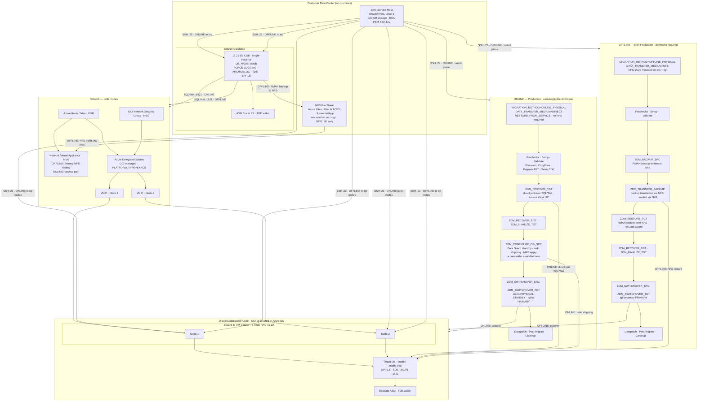

## ZDM Physical Migration to ExaDB-D on Oracle Database@Azure

Two migration paths exist — the choice is driven entirely by whether production downtime is acceptable.

**ONLINE** leverages Data Guard as the transport mechanism. The source stays live throughout; ZDM pulls data directly over SQL*Net using `RESTORE_FROM_SERVICE`, instantiates the target as a physical standby, and lets redo shipping close the gap before switchover. The optional `pauseafter ZDM_CONFIGURE_DG_SRC` holdpoint is critical in practice — it lets teams validate the standby, coordinate application cutover windows, and resume only when ready. Net downtime is effectively the switchover duration.

**OFFLINE** trades downtime for simplicity. RMAN backs up the source to a shared NFS mount, the backup is restored at the target, and the target opens as primary — no standby, no redo shipping. The NVA is the key network dependency here; without it, NFS traffic cannot route between the on-premises network and the OCI delegated subnet inside the Azure VNet.

**The NVA** sits in the Azure VNet for both modes but serves different purposes — primary routing for OFFLINE NFS traffic, backup path for ONLINE. It is not optional for OFFLINE.

**The delegated subnet boundary** is where OCI and Azure meet. NSG controls access into the cluster; UDR controls how traffic is routed within the VNet before it reaches the subnet. VNICs are the attachment point between the Azure network plane and the OCI compute instances.

**TDE is mandatory** in both modes regardless of whether the source is encrypted — a wallet must exist and be open. OFFLINE drops the additional requirement for `FORCE LOGGING` and `ARCHIVELOG` mode since there is no standby to feed.

