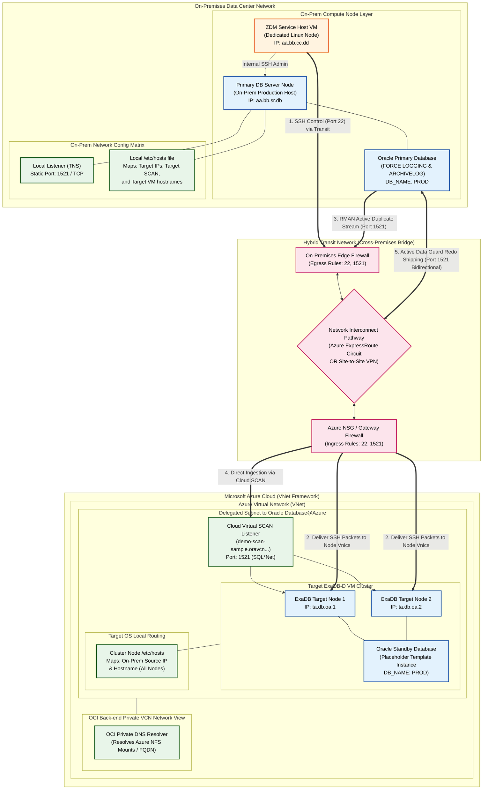

#Mermaidjs for Oracle ZDM on Azure DBAS

```mermaid
flowchart TB
    %% Class Definitions for Styling
    classDef compute fill:#e3f2fd,stroke:#0d47a1,stroke-width:2px,color:#000;
    classDef network fill:#e8f5e9,stroke:#1b5e20,stroke-width:2px,color:#000;
    classDef zdm fill:#fff3e0,stroke:#e65100,stroke-width:2px,color:#000;
    classDef gateway fill:#fce4ec,stroke:#c2185b,stroke-width:2px,color:#000;

    %% ON-PREMISES DATA CENTER NETWORK
    subgraph ON_PREM_NW ["On-Premises Data Center Network"]
        subgraph ON_PREM_COMPUTE ["On-Prem Compute Node Layer"]
            ZDM_HOST["ZDM Service Host VM<br/>(Dedicated Linux Node)<br/>IP: aa.bb.cc.dd"]:::zdm
            SRC_HOST["Primary DB Server Node<br/>(On-Prem Production Host)<br/>IP: aa.bb.sr.db"]:::compute
            SRC_DB["Oracle Primary Database<br/>(FORCE LOGGING & ARCHIVELOG)<br/>DB_NAME: PROD"]:::compute
        end
        
        subgraph ON_PREM_NET ["On-Prem Network Config Matrix"]
            SRC_LST["Local Listener (TNS)<br/>Static Port: 1521 / TCP"]:::network
            SRC_HOST_FILE["Local /etc/hosts file<br/>Maps: Target IPs, Target SCAN,<br/>and Target VM hostnames"]:::network
        end
        
        ZDM_HOST -.->|"Internal SSH Admin"| SRC_HOST
        SRC_HOST --- SRC_DB
        SRC_HOST --- SRC_LST
        SRC_HOST --- SRC_HOST_FILE
    end

    %% HYBRID CONNECTIVITY TRANSIT TIER
    subgraph HYBRID_LINK ["Hybrid Transit Network (Cross-Premises Bridge)"]
        ON_PREM_FW["On-Premises Edge Firewall<br/>(Egress Rules: 22, 1521)"]:::gateway
        CONN_CHANNEL{"Network Interconnect Pathway<br/>(Azure ExpressRoute Circuit<br/>OR Site-to-Site VPN)"}:::gateway
        AZ_EDGE_FW["Azure NSG / Gateway Firewall<br/>(Ingress Rules: 22, 1521)"]:::gateway
        
        ON_PREM_FW <--> CONN_CHANNEL <--> AZ_EDGE_FW
    end

    %% ORACLE DATABASE @ AZURE INFRASTRUCTURE
    subgraph AZURE_CLOUD ["Microsoft Azure Cloud (VNet Framework)"]
        subgraph AZURE_VNET ["Azure Virtual Network (VNet)"]
            
            subgraph DELEGATED_SUBNET ["Delegated Subnet to Oracle Database@Azure"]
                TGT_SCAN["Cloud Virtual SCAN Listener<br/>(demo-scan-sample.oravcn...)<br/>Port: 1521 (SQL*Net)"]:::network
                
                subgraph TGT_CLUSTER ["Target ExaDB-D VM Cluster"]
                    TGT_NODE1["ExaDB Target Node 1<br/>IP: ta.db.oa.1"]:::compute
                    TGT_NODE2["ExaDB Target Node 2<br/>IP: ta.db.oa.2"]:::compute
                    TGT_DB["Oracle Standby Database<br/>(Placeholder Template Instance<br/>DB_NAME: PROD)"]:::compute
                end
                
                subgraph TGT_NET_CONFIG ["Target OS Local Routing"]
                    TGT_HOST_FILE["Cluster Node /etc/hosts<br/>Maps: On-Prem Source IP<br/>& Hostname (All Nodes)"]:::network
                end
            end
            
            subgraph OCI_DNS_RES ["OCI Back-end Private VCN Network View"]
                VCN_RESOLV["OCI Private DNS Resolver<br/>(Resolves Azure NFS Mounts / FQDN)"]:::network
            end
        end
        
        TGT_SCAN --> TGT_NODE1
        TGT_SCAN --> TGT_NODE2
        TGT_NODE1 --- TGT_DB
        TGT_NODE2 --- TGT_DB
        TGT_CLUSTER --- TGT_HOST_FILE
        DELEGATED_SUBNET --- OCI_DNS_RES
    end

    %% NETWORK TRAFFIC DIAGRAM FLOWS
    %% Control Plane Traffic
    ZDM_HOST ==>|"1. SSH Control (Port 22) via Transit"| ON_PREM_FW
    AZ_EDGE_FW ==>|"2. Deliver SSH Packets to Node Vnics"| TGT_NODE1
    AZ_EDGE_FW ==>|"2. Deliver SSH Packets to Node Vnics"| TGT_NODE2

    %% Data Plane Traffic
    SRC_DB ==>|"3. RMAN Active Duplicate Stream (Port 1521)"| ON_PREM_FW
    AZ_EDGE_FW ==>|"4. Direct Ingestion via Cloud SCAN"| TGT_SCAN
    
    SRC_DB <==>|"5. Active Data Guard Redo Shipping (Port 1521 Bidirectional)"| CONN_CHANNEL
```
